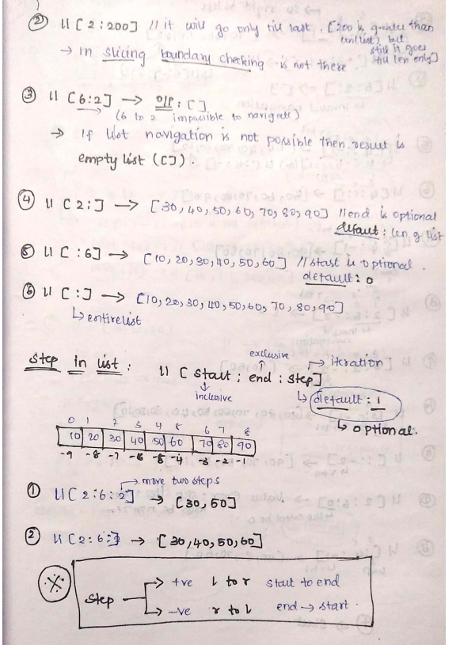

# slot 01 day 05

## list

- list is represented using `[]`
- insertion order is preserved
- duplicates are allowed
- heterogenous elements are allowed.

### indexing

```python
li = [10,20,30,20,30,10]
print(li[0]) # 10
print(li[2]) # 30
print(li[0] is li[5]) # True
```


```python
# li =[10,20,30,40,50,60,70,80,90]
# accessing elements in the list
#     0  1  2  3  4  5  6  7  8  👈 positive index
li =[10,20,30,40,50,60,70,80,90]
#    -9 -8 -7 -6 -5 -4 -3 -2 -1  👈 negative index

# python internally introduced -ve indexing from right for
# easy accessing of list from back.
```

```python
# examples
>>> li = [10,20,30,40,50,60,70,80,90]
>>> li[0]
10
>>> len(li) # to get the count of items in list
9
>>> li[len(li) - 1]
90
>>> li[len(li)-2]
80
>>> li[-1]
90
>>> li[-2]
80
>>> li[4]
50
>>> li[-5]
50
>>> li[25]
Traceback (most recent call last):
  File "<stdin>", line 1, in <module>
IndexError: list index out of range
>>> li[-300]
Traceback (most recent call last):
  File "<stdin>", line 1, in <module>
IndexError: list index out of range
>>> li[3.5]
Traceback (most recent call last):
  File "<stdin>", line 1, in <module>
TypeError: list indices must be integers or slices, not float
>>> li[True}
  File "<stdin>", line 1
    li[True}
           ^
SyntaxError: closing parenthesis '}' does not match opening parenthesis '['
>>> li[True]
20
>>> li[False]
10
>>> li[3+2]
60
>>> # while performing indexing, boundary checking is there.
>>>
```

```python
# To access elements in list
# while 
li = [10,20,30]
i = 0
n = len(li)
while (i < n):
    print(li[i])
    i = i + 1

# for
n = len(li)
for i in range(n):
   print(li[i])

for item in li:
  print(item)
```

### slicing

- whenever we want to work on the part of a list we go for slicing

```python
# li =[10,20,30,40,50,60,70,80,90]
# accessing elements in the list
#     0  1  2  3  4  5  6  7  8  👈 positive index
li =[10,20,30,40,50,60,70,80,90]
#    -9 -8 -7 -6 -5 -4 -3 -2 -1  👈 negative index

# slicing.

# 1. li[start:end]
#        👆   inclusive ( optional )
#  - always goes from start to end
#  - left to right
>>> print(li[2:6]) # [30,40,50,60]
>>> li[2:6]  # [ 2: -3]
>>> li[-6:6] # [-6: -3]


```



